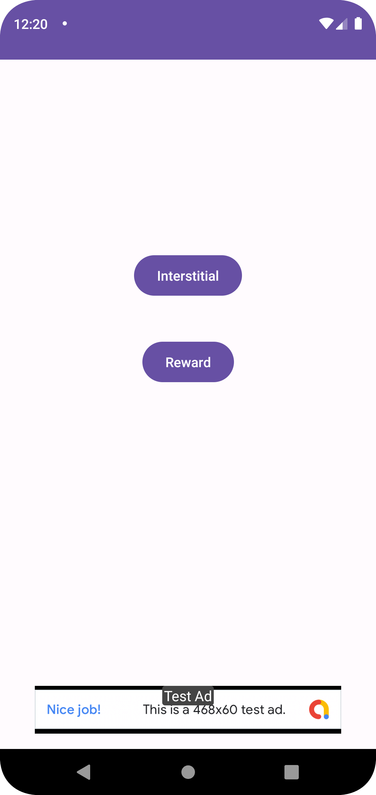
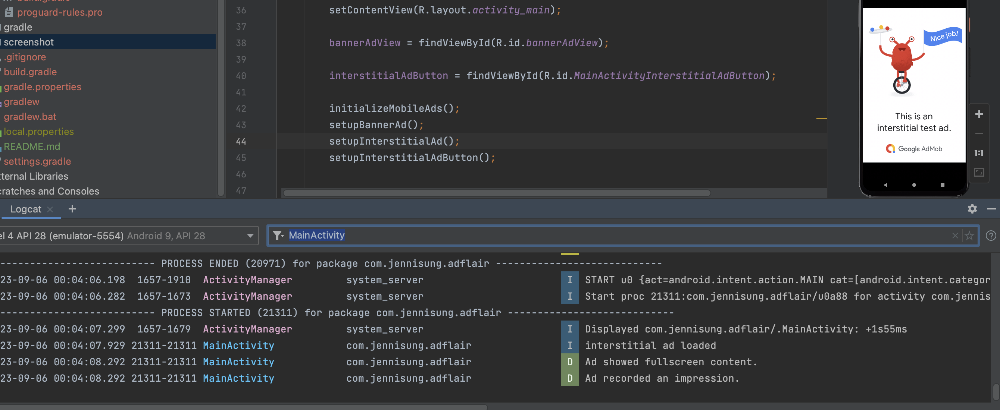
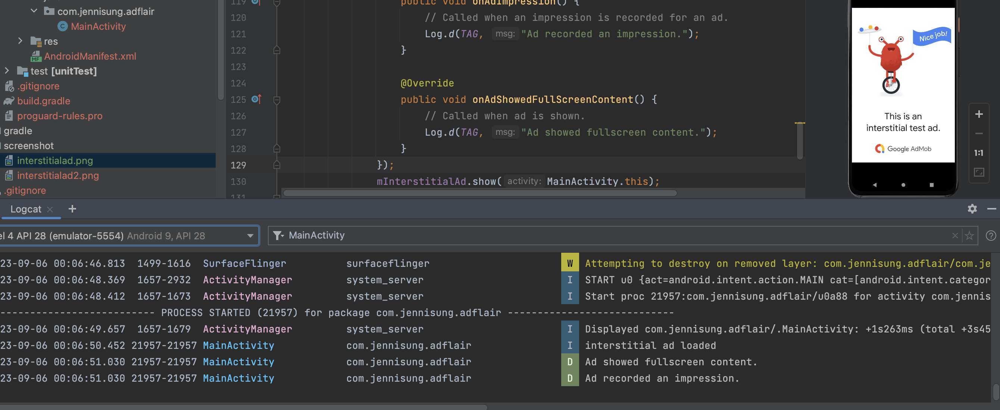
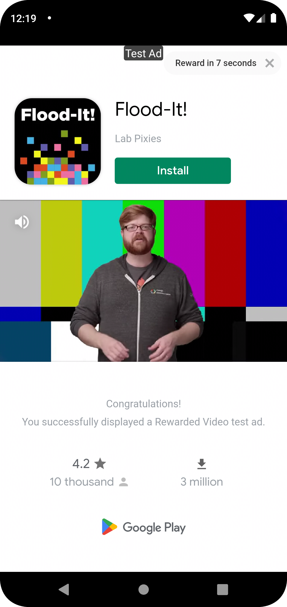
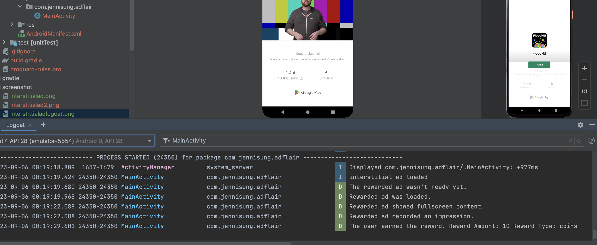

# Lab 42
## Feature Tasks
* Banner Ad: On the “Main” activity, add a banner ad to the bottom of the page and display a Google test ad there.

* Interstitial Ad: Add a button to the “Main” activity that allows users to see an interstitial ad. (In a real app, you’ll want to show this during natural transitions/pauses in your app, but we don’t really have that in this application.)

* Rewarded Ad: Add a button to the “Main” activity that allows users to see a rewarded ad using a Google test ad. When the user clicks the close button, the user should see their reward in a text field next to the button.

# Documentation
## Banner Add

## Interstitial Add

## Rewarded Ad

